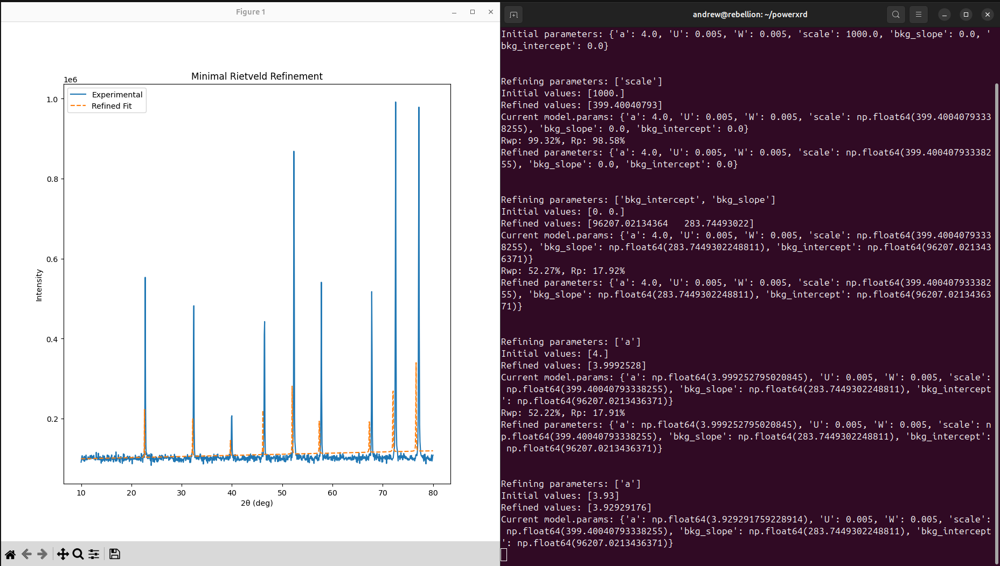

Rietveld refinement
===================

Rietveld refinement is a method for refining crystal structures from X-ray and neutron powder diffraction data. 
Originally developed by Hugo Rietveld in 1969, it's now a staple in materials science for analyzing crystalline phases. 
The method works by modeling an entire diffraction pattern using known structural parameters, which are then adjusted to minimize 
the difference between the observed and calculated data.

Basic Usage with `CubicModel`
-----------------------------

The following example demonstrates a basic refinement workflow using the built-in `CubicModel` and the `RefinementWorkflow` class:

.. code-block:: python

   import powerxrd as xrd
   from powerxrd.model import CubicModel
   import powerxrd.refine as rr

   model = CubicModel()

   # Load and preprocess synthetic data
   x_exp, y_exp = rr.load_data("synthetic-data/sample1.xy")
   x_exp, y_exp = xrd.Chart(x_exp, y_exp).backsub()

   # Define starting parameters
   model.params = {
       "a": 6.0,
       "U": 0.005,
       "W": 0.005,
       "scale": 1000.0,
       "bkg_slope": 0.0,
       "bkg_intercept": 0.0
   }

   rw = xrd.RefinementWorkflow(model, x_exp, y_exp)
   rw.refine(['scale'])        # Stage 1: refine scale
   rw.plot_fit()

   rw.refine(['a', 'U', 'W'])  # Stage 2: refine lattice + profile
   rw.plot_fit()
   rw.save_log('my_stages.json')

This modular API is still under active development and currently supports only **cubic systems** — we’re keeping it simple for now.

Getting Started: `hello_rietveld.py`
------------------------------------

For new users, we recommend starting with the `hello_rietveld*.py` scripts located in the root directory.

These examples walk through a **Minimum Viable Rietveld (MVR)** refinement:
- Load synthetic XRD data
- Apply background subtraction
- Initialize a `CubicModel`
- Refine a single parameter (e.g., `scale`)
- Plot the fit against experimental data

Refinement Example
------------------

Below is the output from a minimal refinement session using the `hello_rietveld_long.py` workflow. 
It shows both:

- The experimental vs. refined pattern (left plot)
- The live parameter optimization and fit statistics (right terminal)

This run used just a handful of parameters — initially refining only `scale`, then adding `a`, `U`, `W`, and background terms. 
Despite the simplicity, the fit successfully reconstructs synthetic XRD data using a `CubicModel`.

Want to try it yourself? Run:

.. code-block:: bash

   python examples/hello_rietveld_long.py

For more extensive workflows, see the :doc:`usage` section — or check out the YouTube tutorials (no TikTok, we promise).  

.. note::
   These scripts are not meant for publication-grade results. They're meant to be clicked, read, broken, and learned from.

Literature
----------------

Rietveld, H.M. (1969), A profile refinement method for nuclear and magnetic structures. J. Appl. Cryst., 2: 65-71. https://doi.org/10.1107/S0021889869006558

FullProf : Rietveld, Profile Matching & Integrated Intensities Refinement of X-ray and/or Neutron Data (powder and/or single-crystal). Link: https://www.ill.eu/sites/fullprof/

Flores-Cano, D. A., Chino-Quispe, A. R., Rueda Vellasmin, R., Ocampo-Anticona, J. A., González, J. C., & Ramos-Guivar, J. A. (2021). Fifty years of Rietveld refinement: 
Methodology and guidelines in superconductors and functional magnetic nanoadsorbents. Revista De Investigación De Física, 24(3), 39-48. https://doi.org/10.15381/rif.v24i3.21028

Ozaki, Y., Suzuki, Y., Hawai, T., Saito, K., Onishi, M., & Ono, K. (2020). Automated crystal structure analysis based on blackbox optimization. npj Computational Materials, 6(1), 75. 
https://doi.org/10.1038/s41524-020-0330-9

Rietveld Refinement for Macromolecular Powder Diffraction Maria Spiliopoulou, Dimitris-Panagiotis Triandafillidis, Alexandros Valmas, Christos Kosinas, Andrew N. Fitch, 
Robert B. Von Dreele, and Irene Margiolaki Crystal Growth & Design 2020 20 (12), 8101-8123 `DOI: 10.1021/acs.cgd.0c00939 <https://pubs.acs.org/doi/abs/10.1021/acs.cgd.0c00939>`_

The Rietveld Refinement Method: Half of a Century Anniversary Tomče Runčevski and Craig M. Brown Crystal Growth & Design 2021 21 (9), 4821-4822 `DOI: 10.1021/acs.cgd.1c00854 <https://pubs.acs.org/doi/10.1021/acs.cgd.1c00854>`_

Diffraction Line Profiles in the Rietveld Method Paolo Scardi Crystal Growth & Design 2020 20 (10), 6903-6916 `DOI: 10.1021/acs.cgd.0c00956 <https://pubs.acs.org/doi/full/10.1021/acs.cgd.0c00956>`_