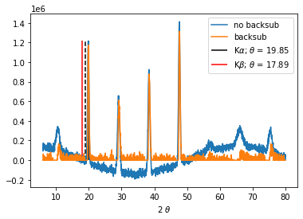
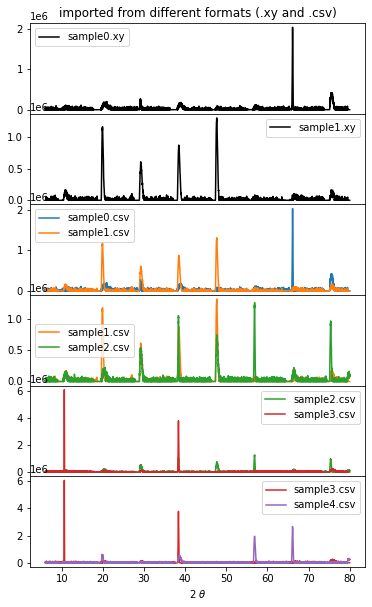
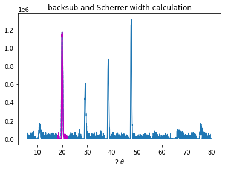
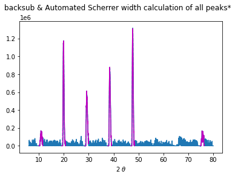
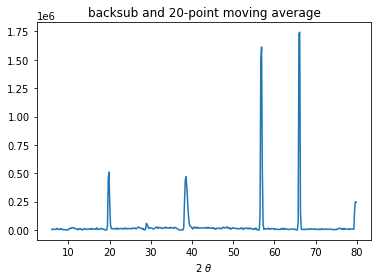

Usage
=====

.. _installation:

Installation
------------

It is recommended you use powerxrd through a virtual environment. You may follow the below simple protocol to create the virtual environment, run it, and install the package there:

.. code-block:: console
   
   $ virtualenv venv
   $ source venv/bin/activate
   (.venv) $ pip install powerxrd

To exit the virtual environment, simply type ``deactivate``. To access it at any other time again, enter with the above ``source`` command.

Data Preparation
---------------------

First, we need to acquire all the synthetic data available on Github, which can be found at `this address <https://github.com/andrewrgarcia/powerxrd/tree/main/synthetic-data>`_. 
Although it's possible to manually download each file by opening the raw text and saving it onto your system, this method can be time-consuming. 
A more efficient approach would be to use an automated wget routine in your command line, as shown below. 

.. code-block:: shell

  !wget https://raw.githubusercontent.com/andrewrgarcia/powerxrd/main/synthetic-data/sample{0..1}.xy
  !wget https://raw.githubusercontent.com/andrewrgarcia/powerxrd/main/synthetic-data/sample{0..4}.csv

It's important to note that these files are not real experimental XRD data, but artificially-generated XRD patterns produced by a function that creates peaks with random heights and random locations.

Basic functionality of powerxrd is shown through the below examples.

Background subtraction
--------------------------------

Single Plot with Emission Lines
........................................

The below example processes the .xy file into a 2-D np.array (x and y arrays) defined as data with the importfile() method from xrd.Data and runs the plot operation of it.

It then processes the contents of the data variable into the xrd.Chart class by unpackaging the x and y arrays in data with the \*data operation and creates a chart object.

This object then runs the emission_lines method to find the location of the secondary radiation source for a peak between 10 and 20 2-theta
degrees and runs the plot operation internally with the show=True kwarg. The chart object then runs the backsub method to subtract the background. 
The processed plot commands are then shown with plt.show. 

.. code-block:: python

  #import packages
  import powerxrd as xrd
  import numpy as np
  import pandas as pd
  import matplotlib.pyplot as plt

  def test_backsub():
      
      data = xrd.Data('sample1.xy').importfile()
      plt.plot(*data,label='no backsub')

      chart = xrd.Chart(*data)
      chart.emission_lines(xrange_Ka=[10,20], show=True)
      plt.plot(*chart.backsub(),label='backsub')
      plt.xlabel('2 $\\theta$')
      plt.legend()
      plt.show()

  test_backsub()

>>> [Out]
local_max -- max x: 19.84993747394748 max y: 1215615.5744729957

Multiple Plots in One Chart
..................................

Multiple plots of background subtracted data can also be made and overlaid in a chart with matplotlib's plt.subplot method. Here importfile('csv') from xrd.Data is used to process comma-separated value (.csv) files.

.. code-block:: python

  def test_backsub_multiplt():

      fig, axs = plt.subplots(6, 1, figsize=(6,10), sharex=True)
      fig.subplots_adjust(hspace=0)

      # xrd.Data import tab-separated files (.xy) file witn importfile() 
      for i in range(2):
          data = xrd.Data('sample{}.xy'.format(i)).importfile()
          chart = xrd.Chart(*data)
          axs[i].plot(*chart.backsub(),color='k',label='sample{}.xy'.format(i))
          axs[i].legend()

      # xrd.Data can now also import csv file with .importfile('csv') option 
      for j in range(2):
          for i in range(1,5):
              data = xrd.Data('sample{}.csv'.format(i+j-1)).importfile()
              chart = xrd.Chart(*data)
              axs[i+1].plot(*chart.backsub(),color='C'+str(i+j-1),label='sample{}.csv'.format(i+j-1))
              axs[i+1].legend()

      plt.xlabel('2 $\\theta$')
      # plt.suptitle('*all plots below are from synthetic data (i.e. not real XRD)')
      axs[0].set_title('imported from different formats (.xy and .csv)')
      plt.show()

  test_backsub_multiplt()

Crystallite Size - Peak Calculations
----------------------------------------
Single Peak
.................

The SchPeak method from the xrd.Chart class is used to calculate the Scherrer length of the peak in the 2-theta range xrange of 18 to 22. 
The show kwarg of this method is set to True to run the plot processing information to plot the highlighted peak (magenta) and the Gaussian fit of the peak (dashed cyan). 
SchPeak also outputs all the fitting information used to calculate the crystallite size with the Scherrer equation. 

.. code-block:: python

  def test_sch():
      
      data = xrd.Data('sample1.xy').importfile()
      chart = xrd.Chart(*data)

      chart.backsub(tol=1.0,show=True)
      chart.SchPeak(xrange=[18,22],verbose=True,show=True)
      plt.xlabel('2 $\\theta$')
      plt.title('backsub and Scherrer width calculation')
      plt.show()

  test_sch()

>>> [Out]
-Gaussian fit results-
y-shift 10071.343657500349
amplitude 498186.5044519722
mean 19.921493157135924
sigma 0.1692913723155234
covariance matrix 
[[ 2.20553363e+07 -1.98537382e+07 -3.73304414e-08 -4.49772395e+00]
 [-1.98537382e+07  7.90011550e+07 -2.89541102e-09  1.78971558e+01]
 [-3.73304414e-08 -2.89541102e-09  9.41177383e-06 -8.26802823e-12]
 [-4.49772395e+00  1.78971558e+01 -8.26802823e-12  1.03289908e-05]]

SchPeak: Scherrer width calc. for peak in range of [18,22]

FWHM == sigma*2*sqrt(2*ln(2)): 0.39865071697939203 degrees
K (shape factor): 0.9
K-alpha: 0.15406 nm 
max 2-theta: 19.91162984576907 degrees

SCHERRER WIDTH: 20.23261907915097 nm

Multiple Peaks (Automated)
..............................

The allpeaks method from the xrd.Chart class is used to automate the calculation for all peaks present [within a certain peak height tolerance] in the XRD spectrum. 
This method calls the SchPeak multiple times and finds peak maxima through a recursion algorithm which crops the ranges to find local maxima from left to right recursively.

allpeaks takes 2 kwargs: The first one is tols, where tols[0] (default=0.2) is the threshold of the height required for a peak to be considered for the Scherrer calculation, 
and tols[1] (default = 0.8) is the "guessed" average half-width distance from the top of every peak to one of their tails. 

.. code-block:: python

  def test_allpeaks():
      
      data = xrd.Data('sample1.csv').importfile()
      chart = xrd.Chart(*data)

      chart.backsub(tol=1,show=True)
      chart.allpeaks(tols=(0.1,0.8), verbose=False, show=True)
      plt.xlabel('2 $\\theta$')
      plt.suptitle('backsub & Automated Scherrer width calculation of all peaks*')
      plt.show()

  test_allpeaks()

>>> [Out]
------------------------------------------------------------------------------------------
ALLPEAKS: Automated Scherrer width calculations with a recursive search of local maxima
--
local_max -- max x: 47.704043351396415 max y: 1311776.3933334802
--
--
local_max -- max x: 47.704043351396415 max y: 1311776.3933334802
local_max -- max x: 19.91162984576907 max y: 1173162.1712873918
local_max -- max x: 10.842851187995 max y: 168253.24331045512
local_max -- max x: 8.406002501042101 max y: 82154.38375744826
local_max -- max x: 12.292621925802418 max y: 74441.86925361764
local_max -- max x: 38.45018757815757 max y: 878296.1296163809
local_max -- max x: 29.19633180491872 max y: 612236.4986085768
local_max -- max x: 27.037098791162983 max y: 106100.29651133435
local_max -- max x: 35.488953730721136 max y: 85476.80399923288
local_max -- max x: 40.45518966235932 max y: 72528.3080639828
local_max -- max x: 75.52730304293456 max y: 167210.87548438687
local_max -- max x: 66.45852438516049 max y: 106019.89694947231
local_max -- max x: 76.85368903709879 max y: 78455.99312843043
--
SUMMARY (.csv format):
2-theta / deg, 	 Intensity, 	 Sch width / nm
10.842851187995, 	  168253.24331045512, 	  9.441628969524054 
19.91162984576907, 	  1173162.1712873918, 	  20.135492415422068 
29.19633180491872, 	  612236.4986085768, 	  14.141811480998149 
38.45018757815757, 	  878296.1296163809, 	  16.68845964623238 
47.704043351396415, 	  1311776.3933334802, 	  20.745821993861888 
75.52730304293456, 	  167210.87548438687, 	  11.141240095107339 

Noise Reduction through a Running Average
-------------------------------------------------

The mav method from the xrd.Data class outputs the x,y data made from a running "n" point average of the original data. Below, you'll see backsub is used in combination with mav to render the plot. mav should be used with care as the operation may result in a substantial loss of resolution. 

.. code-block:: python

  def test_mav():
      
      data = xrd.Data('sample4.csv').importfile()
      chart = xrd.Chart(*data)

      chart.backsub()
      n = 20
      plt.plot(*chart.mav(n))
      plt.xlabel('2 $\\theta$')
      plt.title('backsub and {}-point moving average'.format(n))
      plt.show()

  test_mav()

